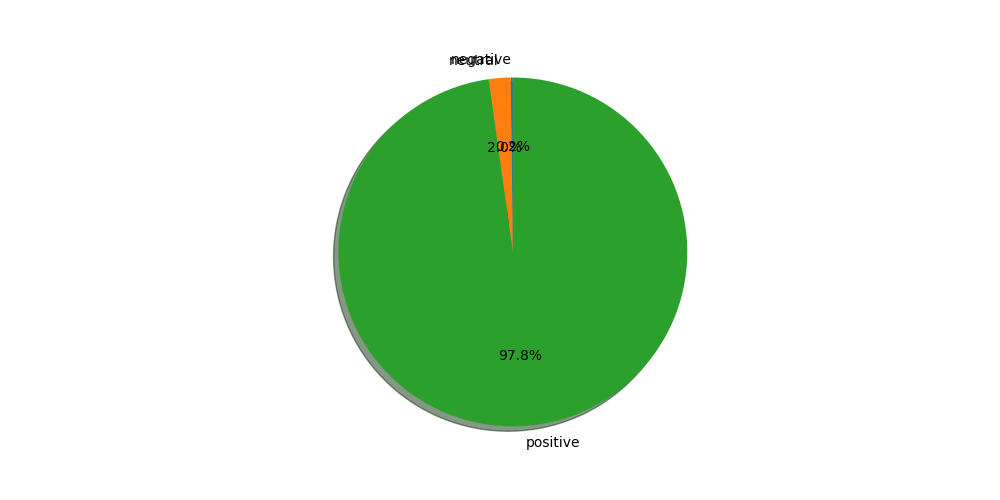

# Overview :
The goal of this project is to use the pretrained twitter ROBERTA model to get the sentiment of youtube videos and present the results in a chart.

# Usage :
```
python analyze.py -v video_link 
```
For example for this video https://www.youtube.com/watch?v=lj5GXZaE7qs, we got :



